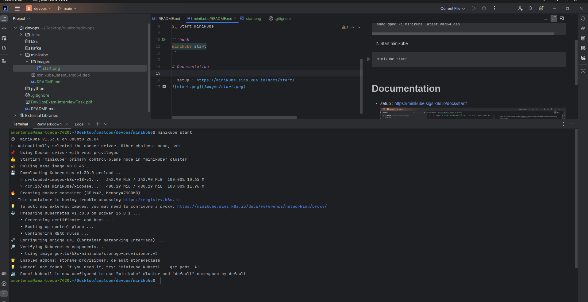
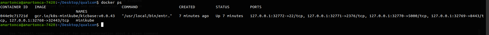
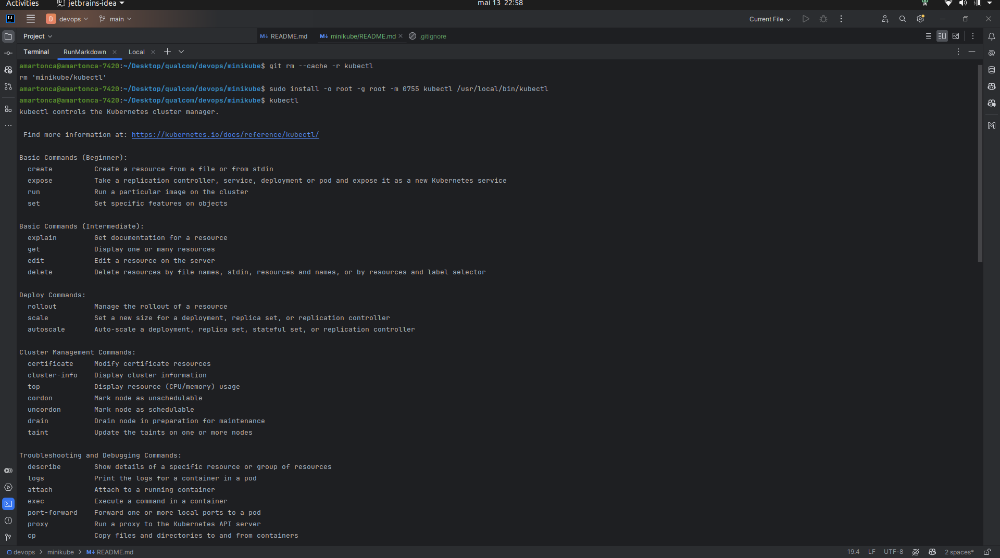
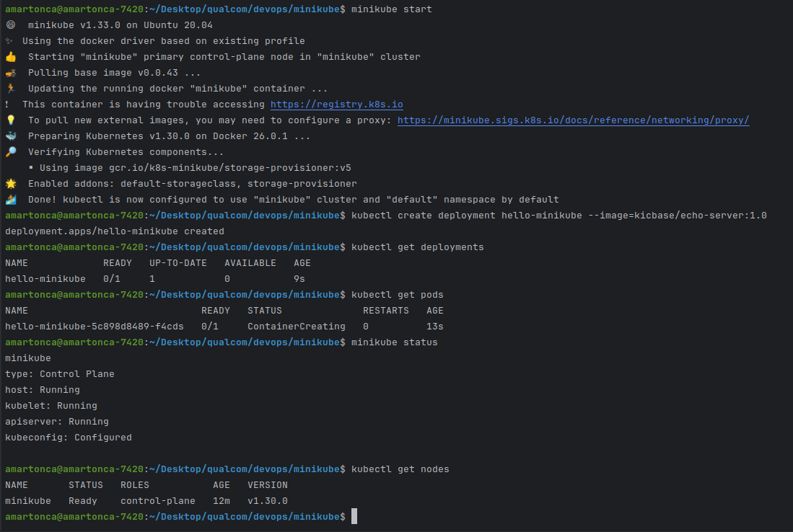

# Set up Local Kubernetes Cluster:

Install and set up a local Kubernetes cluster using a tool like Minikube. Ensure that kubectl is properly configured to
interact with the local cluster.

## How

1. Since I'm running ubuntu x86_64 (`uname -m`), I'll be using minikube to run kubernetes on my local machine.

```bash
curl -LO https://storage.googleapis.com/minikube/releases/latest/minikube_latest_amd64.deb
sudo dpkg -i minikube_latest_amd64.deb
```

2. Start minikube

```bash
minikube start
```



I also see the docker container running



3. I was missing kubectl so I had to install it

```bash 
   curl -LO "https://dl.k8s.io/release/$(curl -L -s https://dl.k8s.io/release/stable.txt)/bin/linux/amd64/kubectl"
   sudo install -o root -g root -m 0755 kubectl /usr/local/bin/kubectl
```


It seems to work fine now.

4. Test that minikube and kubectl are working fine

```bash
minikube status
kubectl get nodes
```

I actually installed a simple default deployment from documentation:

```bash
kubectl create deployment hello-minikube --image=kicbase/echo-server:1.0
```



I guess this concludes the setup of minikube and kubectl on my local machine.

# Documentation

- minikube : https://minikube.sigs.k8s.io/docs/start/
- kubectl: https://kubernetes.io/docs/tasks/tools/install-kubectl-linux/
- minikube kubectl basics : https://minikube.sigs.k8s.io/docs/handbook/controls/
