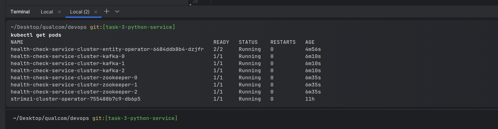
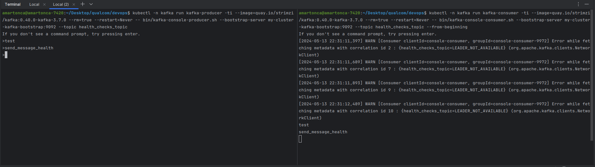

# Set up Kafka Cluster on Kubernetes:

Use Helm or Kubernetes manifests to deploy a Kafka cluster with at least 3 nodes within the Kubernetes
environment.
Create a topic named health_checks_topic with appropriate configurations.

## How

1. I found the Stormzi project online just for booting up kafka on kubernetes.

```bash
kubectl create namespace kafka

# install Stormzi cluster watcher
kubectl create -f 'https://strimzi.io/install/latest?namespace=kafka' -n kafka

# Apply the `Kafka` Cluster CR file
kubectl apply -f kafka-persistent.yaml -n kafka 

# Wait for services to boot-up
kubectl wait kafka/my-cluster --for=condition=Ready --timeout=300s -n kafka 
```



Then to test that it works:

```bash
kubectl -n kafka run kafka-topic-creator -ti --image=quay.io/strimzi/kafka:0.40.0-kafka-3.7.0 --rm=true --restart=Never \
        -- bin/kafka-topics.sh --bootstrap-server my-cluster-kafka-bootstrap:9092 --topic health_checks_topic --create
```

Send messages

```bash
kubectl -n kafka run kafka-producer -ti --image=quay.io/strimzi/kafka:0.40.0-kafka-3.7.0 --rm=true --restart=Never \
      -- bin/kafka-console-producer.sh --bootstrap-server my-cluster-kafka-bootstrap:9092 --topic health_checks_topic
```

Receive messages

```bash
kubectl -n kafka run kafka-consumer -ti --image=quay.io/strimzi/kafka:0.40.0-kafka-3.7.0 --rm=true --restart=Never \
    -- bin/kafka-console-consumer.sh --bootstrap-server my-cluster-kafka-bootstrap:9092 --topic health_checks_topic --from-beginning
```



# Documentation

- namespace : https://kubernetes.io/docs/reference/kubectl/generated/kubectl_create/kubectl_create_namespace/
- minikube proxies: https://minikube.sigs.k8s.io/docs/handbook/vpn_and_proxy/#macos-and-linux
- stormzi: https://strimzi.io/quickstarts/