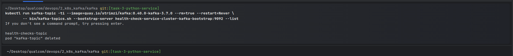
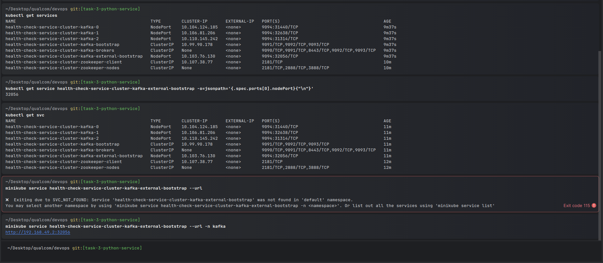

# Set up Kafka Cluster on Kubernetes:

Use Helm or Kubernetes manifests to deploy a Kafka cluster with at least 3 nodes within the Kubernetes
environment.
Create a topic named health_checks_topic with appropriate configurations.

## How

1. I found the Stormzi project online just for booting up kafka on kubernetes.

```bash
kubectl create namespace kafka

# set namespace as default
kubectl config set-context --current --namespace=kafka

# install Stormzi cluster watcher
kubectl create -f 'https://strimzi.io/install/latest?namespace=kafka'
```

Then I applied the `Kafka` Cluster manifest and waited for services to boot-up

```bash
kubectl apply -f kafka-persistent.yaml
  
kubectl wait kafka/health-check-service-cluster --for=condition=Ready --timeout=300s
```


To create a topic, I used another manifest:

```bash
kubectl apply -f kafka-topic.yaml
```

And to validate that the topic was created:

```bash
kubectl run kafka-topic -ti --image=quay.io/strimzi/kafka:0.40.0-kafka-3.7.0 --rm=true --restart=Never \
        -- bin/kafka-topics.sh --bootstrap-server health-check-service-cluster-kafka-bootstrap:9092 --list
```



Then to test that it works i created a producer and a consumer:

Send messages

```bash
kubectl run kafka-producer -ti --image=quay.io/strimzi/kafka:0.40.0-kafka-3.7.0 --rm=true --restart=Never \
      -- bin/kafka-console-producer.sh --bootstrap-server health-check-service-cluster-kafka-bootstrap:9092 --topic health_checks_topic
```

Receive messages

```bash
kubectl run kafka-consumer -ti --image=quay.io/strimzi/kafka:0.40.0-kafka-3.7.0 --rm=true --restart=Never \
    -- bin/kafka-console-consumer.sh --bootstrap-server health-check-service-cluster-kafka-bootstrap:9092 --topic health_checks_topic --from-beginning
```


To clear all kafka resources I used the following command:

```bash
kubectl delete -f kafka-persistent.yaml

kubectl delete -f kafka-topic.yaml

kubectl delete pod kafka-topic --ignore-not-found
kubectl delete pod kafka-producer --ignore-not-found
kubectl delete pod kafka-consumer --ignore-not-found

```

2. By default, the kafka cluster is not accessible from outside the minikube cluster. To make it accessible, i had to
   configure node port for the kafka cluster first by editing the `kafka-persistent.yaml` file and then
   use `minikube service health-check-service-cluster-kafka-external-bootstrap --url -n kafka` to get the url to access

```bash
minikube service health-check-service-cluster-kafka-external-bootstrap --url -n kafka
```



# Documentation

- namespace : https://kubernetes.io/docs/reference/kubectl/generated/kubectl_create/kubectl_create_namespace/
- minikube proxies: https://minikube.sigs.k8s.io/docs/handbook/vpn_and_proxy/#macos-and-linux
- stormzi: https://strimzi.io/quickstarts/
- access kafka outside the minikube cluster with nodeport: https://strimzi.io/blog/2019/04/23/accessing-kafka-part-2/ 