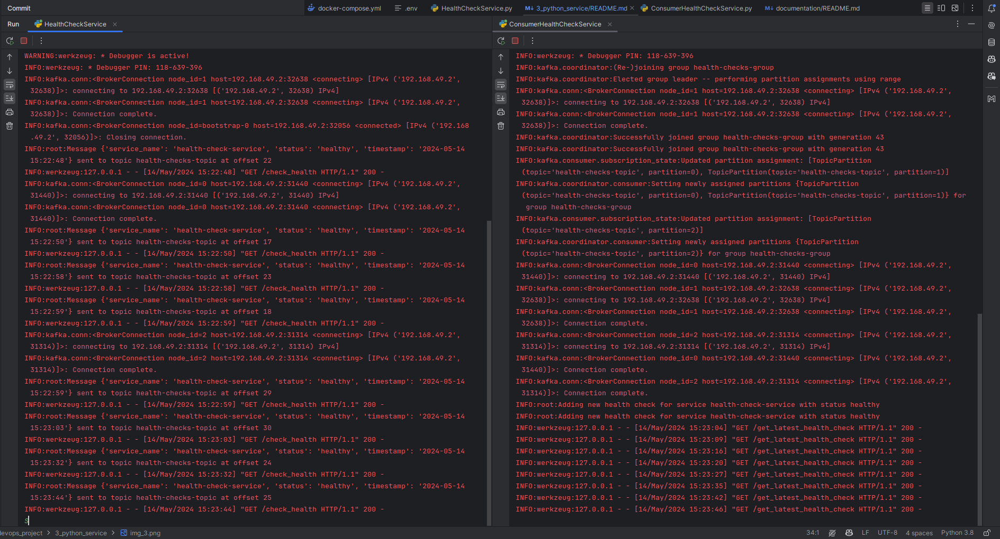
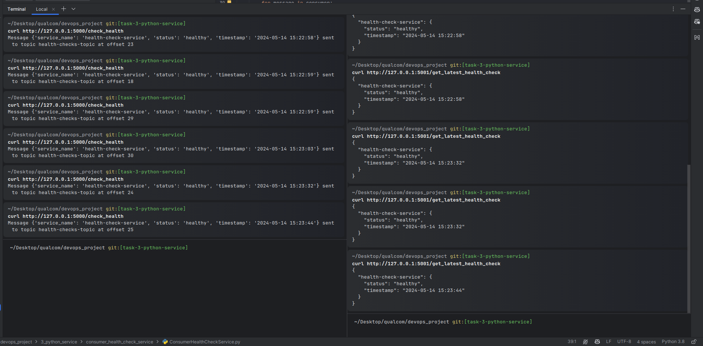
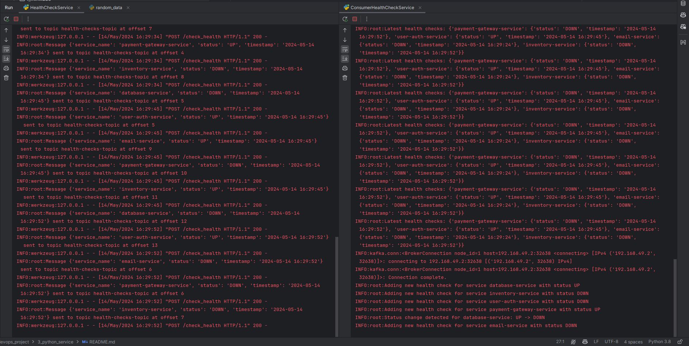
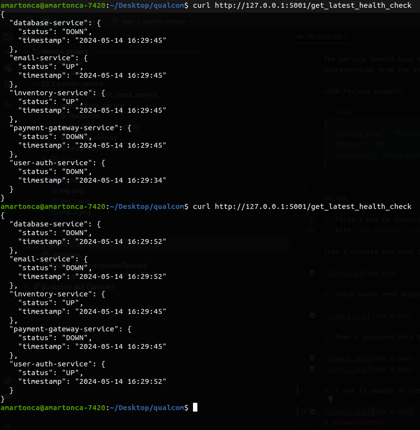

# Python HealthCheckService:

Write a Python service named `HealthCheckService` that periodically performs health checks on various
microservices in the system.

The service should have a REST API endpoint `/check_health` that retrieves the health status of different
microservices from the Kafka topic ( `health_checks_topic` ) and prints the results along with some text to the logs.

JSON Payload example:

```json
{
  "service_name": "MyService",
  "status": "OK",
  "timestamp": "2024-01-01T12:30:45Z"
}
```

## How

1. First i had to install flash `pip install Flask` and setup virtual environment
   with `pip install --upgrade virtualenv`

Then I created and used the virtual environment with `virtualenv -p python3 env && source venv/bin/activate`


2. Setup basic rest endpoint with flask


3. Then i designed both the producer and the consumer to send and receive messages from the kafka topic




4. I had to update my producer to support json payload and my consumer to handle thread concurrency access:



After a few second of starting the consumer, it will go through all the messages in the topic and set the health status
of the services correctly in-memory (not ideal to set health like this but works for this simple use case)




# Documentation

- python with flask for simple rest API
  endpoint: https://medium.com/@onejohi/building-a-simple-rest-api-with-python-and-flask-b404371dc699
- configure kafka to be accessible outside minikube: https://strimzi.io/blog/2019/05/13/accessing-kafka-part-4/
- containerize flask app: https://www.freecodecamp.org/news/how-to-dockerize-a-flask-app/