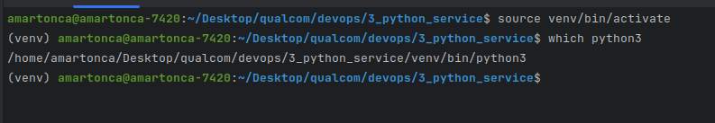
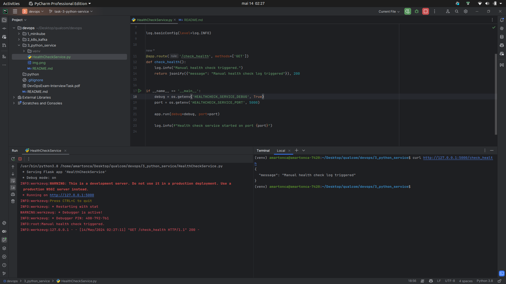

# Python HealthCheckService:

Write a Python service named `HealthCheckService` that periodically performs health checks on various
microservices in the system.

The service should have a REST API endpoint `/check_health` that retrieves the health status of different
microservices from the Kafka topic ( `health_checks_topic` ) and prints the results along with some text to the logs.

JSON Payload example:

```json
{
  "service_name": "MyService",
  "status": "OK",
  "timestamp": "2024-01-01T12:30:45Z"
}
```

## How

1. First i had to install flash `pip install Flask` and setup virtual environment
   with `pip install --upgrade virtualenv`

Then I created and used the virtual environment with `virtualenv -p python3 env && source venv/bin/activate`



2. Setup basic rest endpoint with flask



# Documentation

- python with flask for simple rest API
  endpoint: https://medium.com/@onejohi/building-a-simple-rest-api-with-python-and-flask-b404371dc699