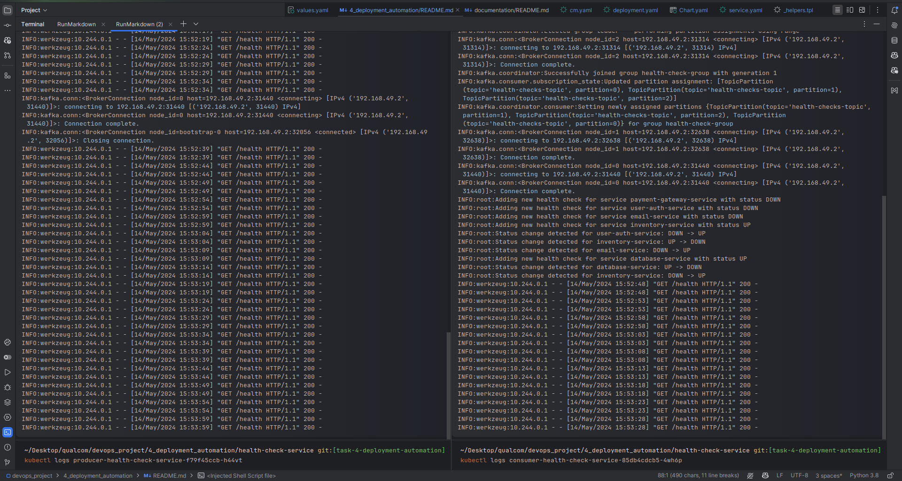
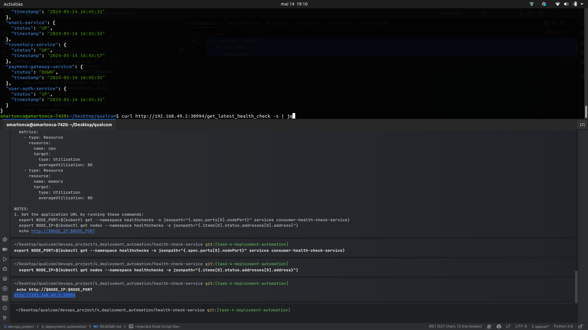

# Deployment Automation

Create Kubernetes deployment manifests for both the HealthCheckService and ConsumerHealthCheckService.
Implement a rolling deployment strategy for these services.

Use ConfigMaps/Secrets to manage any configuration that needs to be externalized. Ensure that the services can
scale horizontally.

## How

1. For this task, I'll leverage on helm charts for easier management. I created the chart
   with `helm create HealthCheckService` and modified it, so it supports both services.

I configured the helm chart to take the image and port as inputs.

2. Next I had to set up the environment variables for the containers in the configmap since i didn't have any secrets
   yet.

To test that the chart is valid, i used helm template:

```bash
helm template \
    -f values.yaml \
    --set image.name=producer \
    --set service.port=5000 \
    --set configmap.data.KAFKA_BOOTSTRAP_SERVERS=some-server \
    --set configmap.data.KAFKA_TOPIC=some-topic \
    --set configmap.data.KAFKA_CONSUMER_GROUP_ID=some-group \
    --set configmap.data.HEALTHCHECK_SERVICE_DEBUG='true' \
    --set configmap.data.CONSUMER_HEALTHCHECK_SERVICE_DEBUG='true' \
    --debug \
    .
```


3. Now installing the chart can be done with the following commands:

First create namespace:

```bash
kubectl create namespace healthchecks
```

```bash
minikube image load consumer:latest;
minikube image load producer:latest;
```


Normally this wouldn't be required but since this is a test cluster with Minikube, it's easier for this use case to just
load the images manually.

```bash
kubectl config set-context --current --namespace=healthchecks;
```

```bash
export KAFKA_BOOTSTRAP_SERVERS="192.168.49.2:32056";
export KAFKA_TOPIC="health-checks-topic";
export KAFKA_CONSUMER_GROUP_ID="health-check-group";
export HEALTHCHECK_SERVICE_DEBUG="false";
export CONSUMER_HEALTHCHECK_SERVICE_DEBUG="false";
```

Install the producer:

```bash
helm upgrade --install \
    -n healthchecks \
    -f values.yaml \
    --set image.name=producer \
    --set service.port=5000 \
    --set configmap.data.KAFKA_BOOTSTRAP_SERVERS="${KAFKA_BOOTSTRAP_SERVERS}"\
    --set configmap.data.KAFKA_TOPIC="${KAFKA_TOPIC}" \
    --set configmap.data.HEALTHCHECK_SERVICE_DEBUG="'${HEALTHCHECK_SERVICE_DEBUG}'" \
     --set autoscaling.enabled=true \
    --wait \
    --debug \
    --atomic \
    --cleanup-on-fail \
    producer .
```

And the consumer:

```bash
helm upgrade --install \
    -n healthchecks \
    -f values.yaml \
    --set image.name=consumer \
    --set service.port=5001 \
    --set configmap.data.KAFKA_BOOTSTRAP_SERVERS="${KAFKA_BOOTSTRAP_SERVERS}"\
    --set configmap.data.KAFKA_TOPIC="${KAFKA_TOPIC}" \
    --set configmap.data.KAFKA_CONSUMER_GROUP_ID="${KAFKA_CONSUMER_GROUP_ID}" \
    --set configmap.data.CONSUMER_HEALTHCHECK_SERVICE_DEBUG="'${CONSUMER_HEALTHCHECK_SERVICE_DEBUG}'" \
    --set autoscaling.enabled=true \
    --wait \
    --debug \
    consumer .
```



At as it can be seen, both services are installed in the minikube cluster and have access to the topic.

4. Autoscaling can be easily configured by using the flag `--set autoscaling.enabled=true` in the helm command to
   assure horizontal scaling.


And to test that it works, I enabled NodePort for the services and sent some requests to the consumer service.


I've also tested the producer service by sending a POST request to the health-check endpoint.


# Documentation

