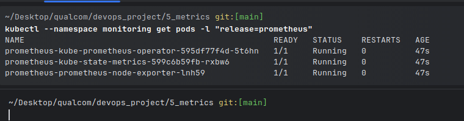
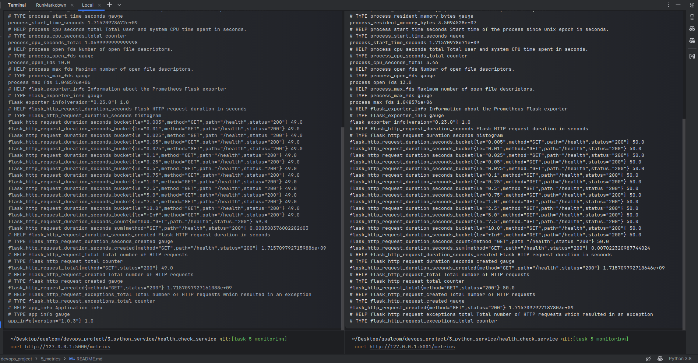

# Monitoring and Logging

Set up monitoring for the Kafka cluster, HealthCheckService, and ConsumerHealthCheckService.
Implement logging for both services, including printing health check results along with some text.

## How

1. Install prometheus in a dedicated namespace

```bash
kubectl create namespace monitoring
```

```bash
kubectl config set-context --current --namespace=monitoring;
```

```bash
helm repo add prometheus-community https://prometheus-community.github.io/helm-charts
helm repo update
```

```bash
helm install prometheus prometheus-community/kube-prometheus-stack
```



2. Setup Prometheus endpoint for Flask apps
   I had to install a module, and it automatically exposes the `/metrics` endpoint which can be collected by prometheus
   in the k8s cluster
3.

