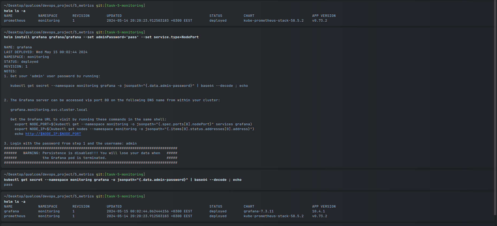
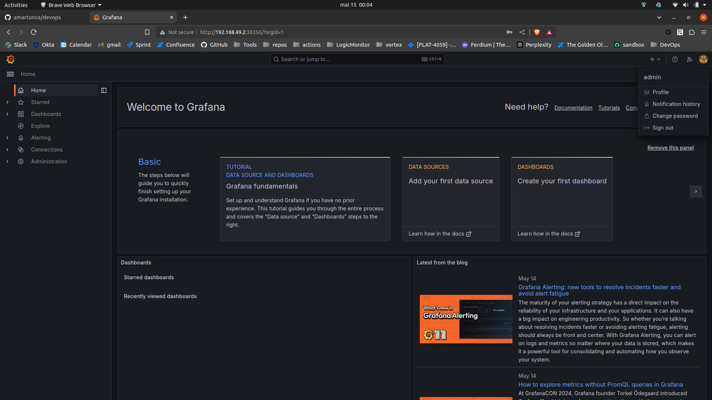
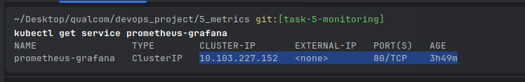
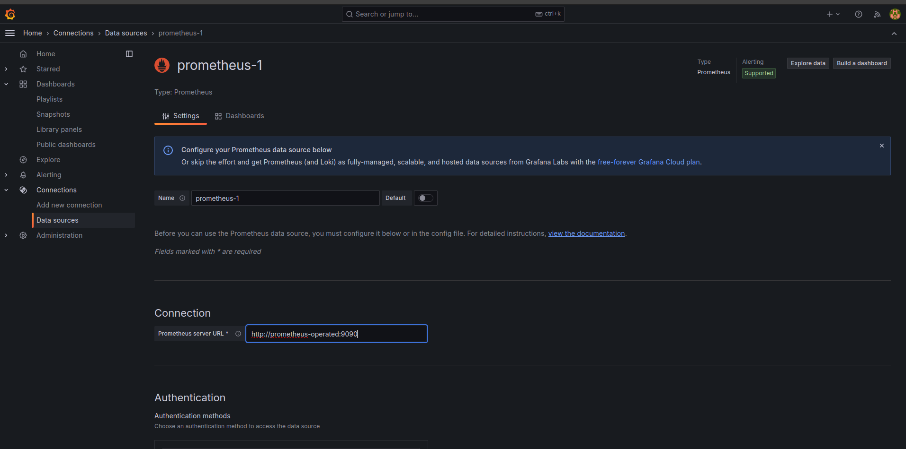

# Monitoring and Logging

Set up monitoring for the Kafka cluster, HealthCheckService, and ConsumerHealthCheckService.
Implement logging for both services, including printing health check results along with some text.

## How

1. Install prometheus in a dedicated namespace

```bash
kubectl create namespace monitoring
```

```bash
kubectl config set-context --current --namespace=monitoring;
```

```bash
helm repo add prometheus-community https://prometheus-community.github.io/helm-charts
helm repo update
```

```bash
helm install prometheus prometheus-community/kube-prometheus-stack
```


2. Setup Prometheus endpoint for Flask apps
   I had to install a module, and it automatically exposes the `/metrics` endpoint which can be collected by prometheus
   in the k8s cluster


3. Setup Grafana for monitoring



Expose service for minikube

```bash
~/Desktop/qualcom/devops_project/5_metrics git:[task-5-monitoring]
minikube service grafana -n monitoring

|------------|---------|-------------|---------------------------|
| NAMESPACE  |  NAME   | TARGET PORT |            URL            |
|------------|---------|-------------|---------------------------|
| monitoring | grafana | service/80  | http://192.168.49.2:30356 |
|------------|---------|-------------|---------------------------|
🎉  Opening service monitoring/grafana in default browser...```
```

Then the UI is available in the browser.


There is an additional step that can be configured in the helm chart to configure the prometheus URL as
datasource but for the simplicity of this example I will add it manually:



